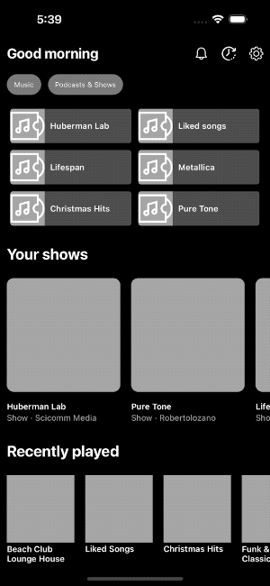

# CompositionalLayout-DiffableDataSource
Simple project that shows the use of `UICollectionViewCompositionalLayout` and `UICollectionViewDiffableDataSource` to create similar collection to Spotify's main screen.

